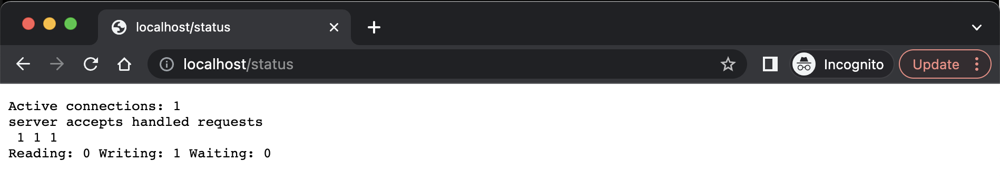

# Simple Docker

Введение в докер. Разработка простого докер образа для собственного сервера.

## Содержание

1. [Part 1. Готовый докер](#part-1-готовый-докер)
2. [Part 2. Операции с контейнером](#part-2-операции-с-контейнером)
3. [Part 3. Мини веб-сервер](#part-3-мини-веб-сервер)
4. [Part 4. Свой докер](#part-4-свой-докер)
5. [Part 5. Dockle](#part-5-dockle)
6. [Part 6. Базовый Docker Compose](#part-6-базовый-docker-compose)

В качестве результата работы по первым двум задачам должен быть предоставлен отчет.
В каждой части задания указано, что должно быть помещено в отчёт, после её выполнения.
Это могут быть ответы на вопросы, скриншоты и т.д.

В качестве результата работы по третьей задаче должны быть предоставлены исходные файлы для запуска веб-сервера.
В качестве результата работы по четвёртой и пятой задачам должны быть предоставлены докерфайлы.
В качестве результата работы по шестой задаче должен быть предоставлен файл *docker-compose.yml* и нужные для его запуска докерфайлы (если они не были предоставлены ранее).

- В репозиторий, в папку src, должен быть загружен отчёт с расширением .md.
- В отчёте должны быть выделены все части задания, как заголовки 2-го уровня.
- В рамках одной части задания всё, что помещается в отчёт, должно быть оформлено в виде списка.
- Каждый скриншот в отчёте должен быть кратко подписан (что показано на скриншоте).
- Все скриншоты обрезаны так, чтобы была видна только нужная часть экрана.
- На одном скриншоте допускается отображение сразу нескольких пунктов задания, но они все должны быть описаны в подписи к скриншоту.
- В репозиторий, в папку src/server, должны быть загружены исходные файлы для запуска веб-сервера из третьего задания.
- В репозиторий, в папку src, должны быть загружены итоговые докерфайлы для запуска образов из четвёртого и пятого заданий.
- В репозиторий, в папку src, должен быть загружен *docker-compose.yml* шестого задания.
- Необходимо быть готовым продемонстрировать решение вживую при необходимости.

## Part 1. Готовый докер

В качестве конечной цели своей небольшой практики вы сразу выбрали написание докер образа для собственного веб сервера, а потому в начале вам нужно разобраться с уже готовым докер образом для сервера. Ваш выбор пал на довольно простой **nginx**.

- В отчёт поместить скрины:
  - вызова и вывода всех использованных в этой части задания команд;
  - стартовой страницы **nginx** по адресу *localhost:80* (адрес должен быть виден).

*Замечание:* **Не загружайте тяжелые файлы (>10 мб) в гит.**

## 1. Взять официальный докер образ с **nginx** и выкачать его при помощи `docker pull`

Если задание выполняется на школьном Мак необходимо подготовиться профиль, чтобы образы выкачивались на локальный носитель в goinfree, инструкция по [ссылке](https://21-school-by-students.notion.site/Docker-install-on-school-iMacs-9354ef106a8a40c6b46a69cea0a11bf8), иначе при первом запуске Docker все свободное место в профиле будет занято.

> rm -rf ~/Library/Containers/com.docker.docker  
> mkdir -p ~/goinfre/Docker/Data  
> ln -s ~/goinfre/Docker ~/Library/Containers/com.docker.docker  

Это удалит папку с контейнерами докера в домашней директории и линканет ее в goinfre

Если все было сделано правильно Докер успешно запустится и свободное место в профиле практически не изменится

На сайте [https://hub.docker.com/](https://hub.docker.com/) ищем необходимый нам образ **nginx** и выкачиваем командой **docker pull nginx**

## 2. Проверить наличие докер образа через `docker images`

## 3. Запустить докер образ через `docker run -d [image_id|repository]`

## 4. Проверить, что образ запустился через `docker ps`

## 5. Посмотреть информацию о контейнере через `docker inspect [container_id|container_name]`

## 6. По выводу команды определить и поместить в отчёт размер контейнера, список замапленных портов и ip контейнера

Информацию о размере контейнера можно получить если использовать ключ -s

> docker inspect -s [container_id|container_name]

- "SizeRw" - показывает насколько измененились файлы в контейнере по отношению к исходному образу. При изменении размер растет.
- "sizeRootFs" - показывает общий размер всех файлов в контейнере.

## 7. Остановить докер образ через `docker stop [container_id|container_name]`

## 8. Проверить, что образ остановился через `docker ps`
см. предыдущую картинку

## 9. Запустить докер с замапленными портами 80 и 443 на локальную машину через команду *run*

> docker run -d -p 80:80 -p 443:443 nginx

- -d(detached) - запускаем контейнер в фоне
- -p(publish port) - внешний порт(порт хоста):внутренний порт(порт контейнера)

 ## 10. Проверить, что в браузере по адресу *localhost:80* доступна стартовая страница **nginx**

 ## 11. Перезапустить докер контейнер через `docker restart [container_id|container_name]`

 ## 12. Проверить любым способом, что контейнер запустился
см. предыдущую картинку

## Part 2. Операции с контейнером

Докер образ и контейнер готовы. Теперь можно покопаться в конфигурации **nginx** и отобразить статус страницы.
- В отчёт поместить скрины:
  - вызова и вывода всех использованных в этой части задания команд;
  - содержимое созданного файла *nginx.conf*;
  - страницы со статусом сервера **nginx** по адресу *localhost:80/status*.

В помощь https://docs.docker.com/engine/reference/commandline/cli/

## 1. Прочитать конфигурационный файл *nginx.conf* внутри докер контейнера через команду *exec*
По умолчанию, конфигурационный файл называется nginx.conf и расположен в каталоге /usr/local/nginx/conf, /etc/nginx или /usr/local/etc/nginx.

> docker exec <-it> [container_id|container_name] [cmd] <cmd_param>

- --interactive , -i - сохраняет ввод открытым, даже если если он не подключен
- --tty , -t - выделяет псевдо-TTY

Например запуск bash внутри контейнера, выглядит так:
> docker exec -it [container_id|container_name] bash

Читаем файл *nginx.conf*
> docker exec [container_id|container_name] cat /etc/nginx/nginx.conf

## 2. Создать на локальной машине файл *nginx.conf*
Создаем исходный *nginx.conf* локально, на мой взгляд, правильнее было бы сделать свой файл конфигурации в /etc/nginx/conf.d/my.conf или править /etc/nginx/conf.d/default.conf, далее этот файл автоматом подключился бы через include в /etc/nginx/nginx.conf

## 3. Настроить в нем по пути */status* отдачу страницы статуса сервера **nginx**
https://ubiq.co/tech-blog/how-to-enable-nginx-status-page/
http://nginx.org/ru/docs/http/ngx_http_stub_status_module.html

Добавляем в файл nginx.conf конфигурацию сервера и вывод статуса(скопипастил из default.conf), также закоментировал include, чтобы не было конфликтов
>	server { \
>	listen 80; \
>	listen [::]:80; \
>	server_name  localhost; \
>\
> \# access_log  /var/log/nginx/host.access.log  main; \
>\
> location / { \
> &nbsp;&nbsp;root   /usr/share/nginx/html; \
> &nbsp;&nbsp;index  index.html index.htm; \
>} \
> \
>	location /status { \
>&nbsp;&nbsp;stub_status; \
>\# allow 127.0.0.1; \#only allow requests from localhost \
>\# deny all; \#deny all other hosts \
>} \
> \
>	\#error_page  404              /404.html; \
> \
>	\# redirect server error pages to the static page /50x.html \
>	error_page   500 502 503 504  /50x.html; \
>	location = /50x.html { \
>&nbsp;&nbsp;root   /usr/share/nginx/html; \
>	} \
>\#	include /etc/nginx/conf.d/*.conf; \

в правилах allow и deny задаются хосты с которых разрешен/запрещен доступ, в случае докера, 127.0.0.1 будет localhost запущенного контейнера

## 4. Скопировать созданный файл *nginx.conf* внутрь докер образа через команду `docker cp`

## 5. Перезапустить **nginx** внутри докер образа через команду *exec*
Когда nginx запущен, им можно управлять, вызывая исполняемый файл с параметром -s.
Используйте следующий синтаксис:

> nginx -s *сигнал*

Где *сигнал* может быть одним из нижеследующих:
- stop — быстрое завершение
- quit — плавное завершение
- reload — перезагрузка конфигурационного файла
- reopen — переоткрытие лог-файлов

## 6. Проверить, что по адресу *localhost:80/status* отдается страничка со статусом сервера **nginx**

## 7. Экспортировать контейнер в файл *container.tar* через команду *export*

## 8. Остановить контейнер

## 9. Удалить образ через `docker rmi [image_id|repository]`, не удаляя перед этим контейнеры

## 10. Удалить остановленный контейнер

## 11. Импортировать контейнер обратно через команду *import*

## 12. Запустить импортированный контейнер
https://andybor.blogspot.com/2021/07/docker-saveload-docker-exportimport.html?m=1

- docker save – сохраняет докер-имидж как tar-архив. Этот архив можно, например,
скопировать на другую машину.
- docker load – создаёт докер-имидж из tar-архива созданного командой docker save
- docker export – сохраняет файловую систему докер-контейнера как как tar-архив.
- docker import – создает докер-имидж, а не докер-контейнер из tar-архива созданного   командой docker export.

Просто запустить импортированный контейнер не получится, т.к. экспорт сохранил состояние файлов образа в рабочий момент, также nginx в образе запускается интерактивно, не демоном. Поэтому при запуске контейнера указываем запуск nginx

>docker run -d -p 80:80  ngx_new nginx -g "daemon off;"

## 13. Проверить, что по адресу *localhost:80/status* отдается страничка со статусом сервера **nginx**

## Part 3. Мини веб-сервер

Настало время немного оторваться от докера, чтобы подготовиться к последнему этапу. Настало время написать свой сервер.
### 1. Написать мини сервер на **C** и **FastCgi**, который будет возвращать простейшую страничку с надписью `Hello World!`

Для установки [**libfcgi-dev** в Ubuntu / Linux Mint / Debian](https://onstartup.ru/biblioteki-dlja-razrabotki/libfcgi-dev/), введите в Терминал:
> sudo apt update  
> sudo apt install libfcgi-dev

Для [Mac](https://formulae.brew.sh/formula/fcgi)
> brew install fcgi

Доп. ссылки:
https://habr.com/ru/post/154187/ (дубль статьи https://www.pvsm.ru/web-razrabotka/16938)  
https://github.com/FastCGI-Archives  
https://packages.debian.org/ru/sid/libfcgi-dev  

В задании требуется написать сервер который буде запускаться через *spawn_fcgi*  
В папке server/ две версии, для запуска через *spawn_fcgi* и без.  
Насколько я понял *spawn_fcgi* нужен для запуска старых *cgi* приложений.  

### 2. Запустить написанный мини сервер через *spawn-fcgi* на порту 8080

https://vds-admin.ru/unix-commands/spawn-fcgi  
https://linux.die.net/man/1/spawn-fcgi

Для установки [**spawn-fcgi** в Ubuntu / Linux Mint / Debian](https://onstartup.ru/programmy-dlja-web/spawn-fcgi/), введите в Терминал:
> sudo apt update  
> sudo apt install spawn-fcgi

Для [Mac](https://formulae.brew.sh/formula/fcgi)
> brew install spawn-fcgi

Запускаем сервер
> spawn-fcgi -p 8080 -n ./fcgi_hello  

-p 8080 - запуск сервера на порту 8080  
-n - не запускать в фоновом процессе  

##### PS: в папку src/server, должны быть загружены исходные файлы для запуска веб-сервера

### 3. Написать свой *nginx.conf*, который будет проксировать все запросы с 81 порта на *127.0.0.1:8080*

Установка **nginx** на Mac
> brew install nginx  
>\---  
>The default port has been set in /Users/cyetta/.brew/etc/nginx/nginx.conf to 8080 so that
nginx can run without sudo.  
>  
>nginx will load all files in /Users/cyetta/.brew/etc/nginx/servers/.  
>  
>To restart nginx after an upgrade:  
>&nbsp;&nbsp;brew services restart nginx  
>Or, if you don't want/need a background service you can just run:  
>&nbsp;&nbsp;/Users/cyetta/.brew/opt/nginx/bin/nginx -g daemon off;  

Добавляем секцию в $HOME/.brew/etc/nginx/nginx.conf
>server {  
>    listen       81;  
>    server_name localhost;  
>    location / {  
>&nbsp;&nbsp; fastcgi_pass   127.0.0.1:8080;  
>&nbsp;&nbsp; include fastcgi_params;  
>    }  
>}  

и запускаем в основном потоке
> nginx -g "daemon off;"

### 4. Проверить, что в браузере по *localhost:81* отдается написанная вами страничка

### 5. Положить файл *nginx.conf* по пути *./nginx/nginx.conf* (это понадобится позже)

> cp  $HOME/.brew/etc/nginx/nginx.conf src/nginx/nginx.conf 

## Part 4. Свой докер

Теперь всё готово. Можно приступать к написанию докер образа для созданного сервера.
*При написании докер образа избегайте множественных вызовов команд RUN*

**== Задание ==**

### Написать свой докер образ, который:
### 1) собирает исходники мини сервера на FastCgi из [Части 3](#part-3-мини-веб-сервер)

### 2) запускает его на 8080 порту
### 3) копирует внутрь образа написанный *./nginx/nginx.conf*
### 4) запускает **nginx**.

_**nginx** можно установить внутрь докера самостоятельно, а можно воспользоваться готовым образом с **nginx**'ом, как базовым._

##### Собрать написанный докер образ через `docker build` при этом указав имя и тег
> docker build -t my_fcgi_hello:1.0 .

##### Проверить через `docker images`, что все собралось корректно

##### Запустить собранный докер образ с маппингом 81 порта на 80 на локальной машине и маппингом папки *./nginx* внутрь контейнера по адресу, где лежат конфигурационные файлы **nginx**'а (см. [Часть 2](#part-2-операции-с-контейнером))
>docker run -d -p80:81 -v $PWD/nginx/nginx.conf:/etc/nginx/nginx.conf my_fcgi_hello:1.0  

пробрасываю nginx.conf файл в контейнер. Если пробросить папку целиком не будут видны остальные файлы настроек nginx.

##### Проверить, что по localhost:80 доступна страничка написанного мини сервера

##### Дописать в *./nginx/nginx.conf* проксирование странички */status*, по которой надо отдавать статус сервера **nginx**

##### Перезапустить докер образ
*Если всё сделано верно, то, после сохранения файла и перезапуска контейнера, конфигурационный файл внутри докер образа должен обновиться самостоятельно без лишних действий*
##### Проверить, что теперь по *localhost:80/status* отдается страничка со статусом **nginx**
  

##### Вариант 2, перезапуск контейнера

## Part 5. **Dockle**

После написания образа никогда не будет лишним проверить его на безопасность.

**== Задание ==**

##### Просканировать образ из предыдущего задания через `dockle [image_id|repository]`
##### Исправить образ так, чтобы при проверке через **dockle** не было ошибок и предупреждений

>> export DOCKER_CONTENT_TRUST=1; dockle my_fcgi_hello:1.0; unset DOCKER_CONTENT_TRUST

Ошибка идет из базового образа nginx

## Part 6. Базовый **Docker Compose**

Вот вы и закончили вашу разминку. А хотя погодите...
Почему бы не поэкспериментировать с развёртыванием проекта, состоящего сразу из нескольких докер образов?

**== Задание ==**

##### Написать файл *docker-compose.yml*, с помощью которого:
##### 1) Поднять докер контейнер из [Части 5](#part-5-инструмент-dockle) _(он должен работать в локальной сети, т.е. не нужно использовать инструкцию **EXPOSE** и мапить порты на локальную машину)_
##### 2) Поднять докер контейнер с **nginx**, который будет проксировать все запросы с 8080 порта на 81 порт первого контейнера
##### Замапить 8080 порт второго контейнера на 80 порт локальной машины
##### Остановить все запущенные контейнеры

##### Собрать и запустить проект с помощью команд `docker-compose build` и `docker-compose up`

##### Проверить, что в браузере по *localhost:80* отдается написанная вами страничка, как и ранее

